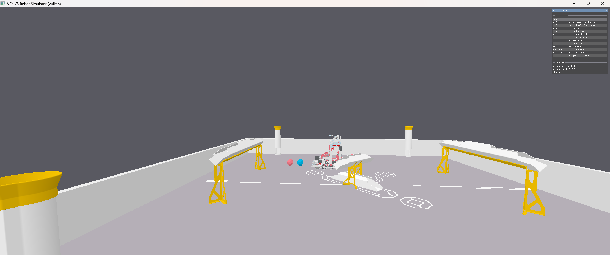

# 3D Robotics Driving Simulation



A high-performance 3D robotics simulator built with C++, Vulkan, and Nvidia PhysX. This project simulates a VEX V5 robot driving, manipulating game elements (blocks), and interacting with a physics-based environment.

## Features

- **Vulkan Rendering**: Modern, high-efficiency graphics pipeline.
- **PhysX Physics**: Realistic rigid body dynamics, collisions, and friction.
- **Robot Simulation**:
  - Tank drive control (split arcade).
  - Intake and outtake mechanisms.
  - Block spawning and interaction.
- **Interactive Camera**: Orbit, pan, and zoom controls.
- **ImGui Overlay**: Real-time controls, status monitoring, and debug info.

## Controls

| Key | Action |
| :--- | :--- |
| **A / Z** | Right wheels Forward / Backward |
| **D / C** | Left wheels Forward / Backward |
| **R** | Spawn **Red** Block |
| **B** | Spawn **Blue** Block |
| **F** | Intake Block (hold) |
| **G** | Outtake Block (eject) |
| **H** | Toggle Info Panel |
| **ESC** | Quit Application |
| **Arrows** | Pan Camera |
| **RMB + Drag** | Orbit Camera |
| **MWheel** | Zoom In/Out |

## Prerequisites

To build and run this project, you need:

1. **C++ Compiler**: A modern C++17 compliant compiler (MSVC 2019+ recommended for Windows).
2. **CMake**: Version 3.14 or later.
3. **Vulkan SDK**: Installed and available in your `PATH`.
4. **Git**: For fetching dependencies.

## Build Instructions

This project uses CMake and `FetchContent` to manage most dependencies (GLFW, glm, etc.). However, **PhysX** must be manually linked or built if not provided.

1. **Clone the repository**:

    ```bash
    git clone https://github.com/Salmon46/3d-robotics-simulator.git
    cd 3d-robotics-simulator/simulator
    ```

2. **Configure with CMake**:

    ```bash
    mkdir build
    cd build
    cmake ..
    ```

3. **Build**:

    ```bash
    cmake --build . --config Release
    ```

4. **Run**:
    The executable `simulator.exe` will be in the `bin/Release` folder (or similar, depending on your generator).

    ```bash
    ./bin/Release/simulator.exe
    ```

## Architecture

See [ARCHITECTURE.md](ARCHITECTURE.md) for details on the code structure and key subsystems.

## License

This project is licensed under the MIT License - see the [LICENSE](LICENSE) file for details.
